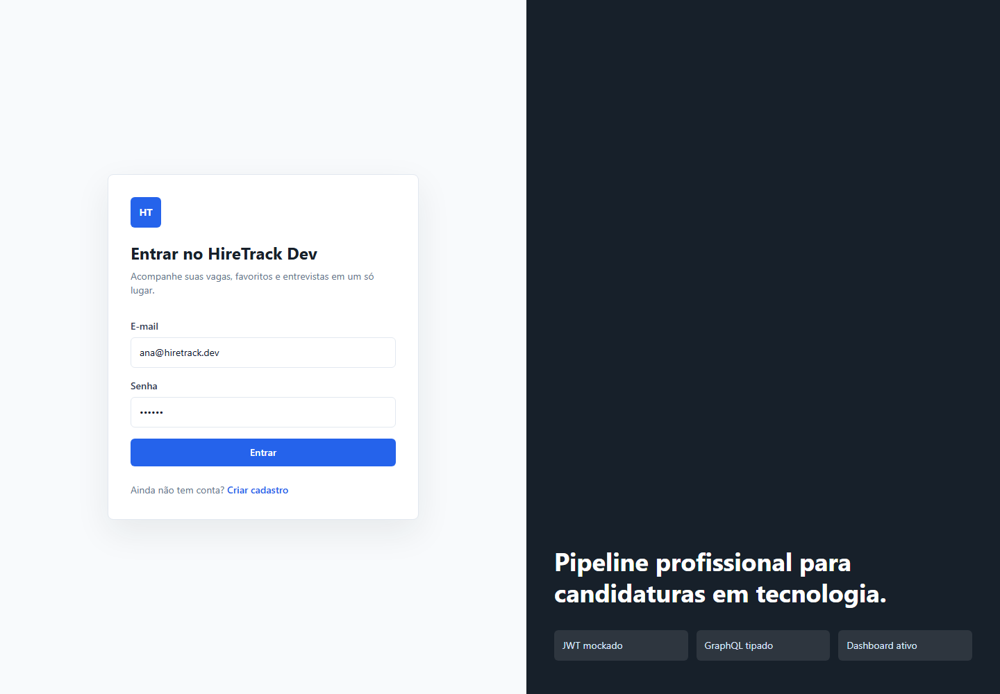
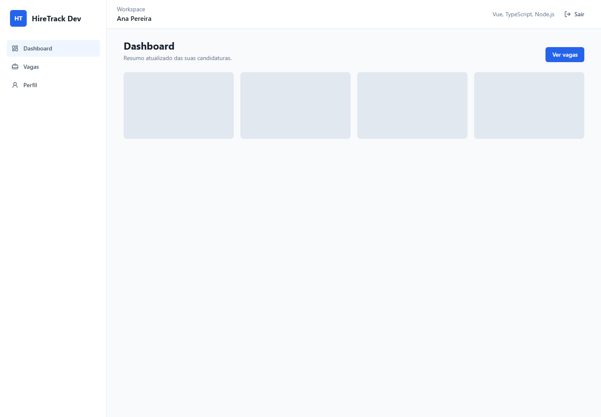
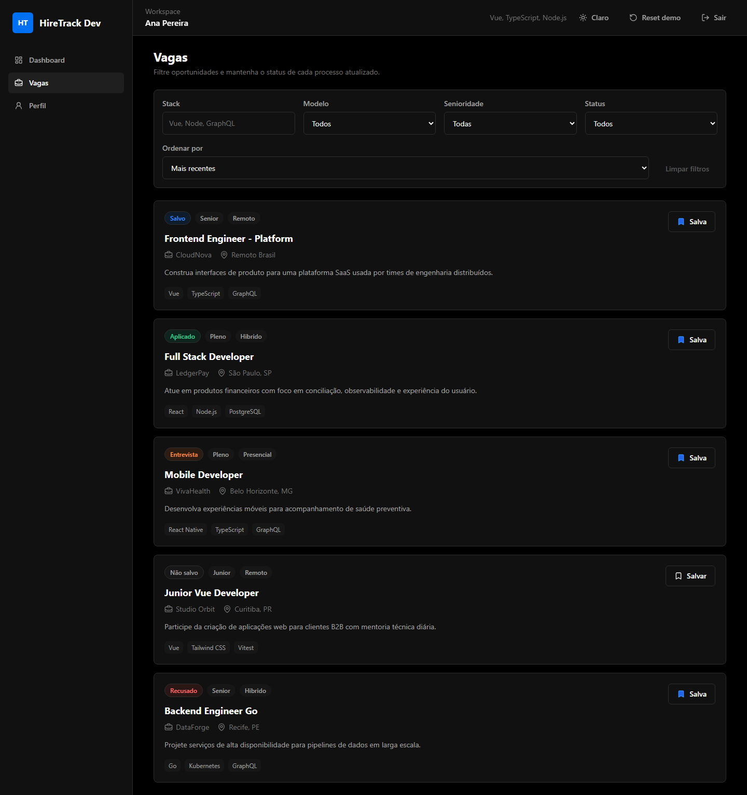

# HireTrack Dev

[](https://github.com/PedroFSO/hire-track-dev/actions/workflows/ci.yml)


Frontend em Vue 3 para gerenciamento profissional de candidaturas em vagas de tecnologia. O app simula uma experiência de produto real com autenticação, rotas privadas, dashboard, filtros, favoritos, pipeline, notas, próxima entrevista, histórico de status, validação de formulários, MSW, testes automatizados, Storybook, observabilidade opcional e deploy na Vercel.

## Demonstração

- Deploy: https://hire-track-dev.vercel.app
- Login demo: https://hire-track-dev.vercel.app/login?redirect=/dashboard
- E-mail demo: `ana@hiretrack.dev`
- Senha demo: `123456`

> O backend e a autenticação são mockados para fins de demonstração. A arquitetura já separa contratos de serviço para facilitar a troca por uma API real.

## Screenshots

| Login                                | Dashboard                                    | Vagas                               |
| ------------------------------------ | -------------------------------------------- | ----------------------------------- |
|  |  |  |

## Funcionalidades

- Login e cadastro com sessão JWT mockada em `localStorage`.
- Expiração de sessão após 8 horas.
- Rotas públicas, privadas e página 404.
- Dashboard com métricas, gráficos, insights e Kanban de candidaturas.
- Métricas avançadas: taxas, próxima entrevista e última atualização.
- Listagem de vagas com filtros, busca com debounce e ordenação.
- Command palette com `Ctrl+K`.
- Exportação de candidaturas em CSV.
- Favoritos com confirmação de remoção.
- Notas por candidatura, data da próxima entrevista, contato e histórico de status.
- Estados profissionais de loading, erro e vazio.
- Feedback visual com toasts.
- Validação de formulários com Zod.
- MSW opcional para simular fronteira HTTP em desenvolvimento.
- Observabilidade opcional com Sentry.
- Testes unitários, coverage, E2E e acessibilidade com axe.
- Storybook com tema claro/escuro para documentação de componentes.
- Configuração para Vercel, Netlify, Docker e GitHub Actions.

## Stack

- Vue 3 + Composition API + TypeScript
- Vite
- Tailwind CSS
- Pinia
- Vue Router
- VueUse
- Zod
- MSW
- Sentry
- Vitest + Testing Library + Coverage
- Playwright + axe
- Storybook
- ESLint + Prettier
- Docker + Nginx

## Arquitetura

- `src/pages`: telas principais.
- `src/components`: componentes compartilhados e stories.
- `src/stores`: estado de domínio com Pinia.
- `src/services`: contratos e fronteira para API/mock.
- `src/graphql`: client mockado atual.
- `src/config`: validação de variáveis de ambiente.
- `src/tests`: testes unitários e de componentes.
- `e2e`: testes Playwright.

Mais detalhes em [docs/architecture.md](docs/architecture.md).

## Como Rodar Localmente

```bash
npm install
cp .env.example .env
npm run dev
```

Acesse `http://localhost:5173`.

## Variáveis De Ambiente

```env
VITE_APP_NAME=HireTrack Dev
VITE_API_URL=
VITE_ENABLE_MSW=false
VITE_SENTRY_DSN=
```

Use `VITE_ENABLE_MSW=true` para ativar os handlers de MSW no navegador durante desenvolvimento. Use `VITE_SENTRY_DSN` em produção para habilitar monitoramento de erros no Sentry.

## Qualidade

```bash
npm run format:check
npm run lint
npm run test
npm run test:coverage
npm run build
npm run test:e2e
npm run screenshots
npm run storybook
npm run build:storybook
```

O GitHub Actions roda formatação, lint, testes unitários, coverage, build de produção, build do Storybook, E2E e captura screenshots como artefatos.

## Storybook

```bash
npm run storybook
```

O build estático é gerado com:

```bash
npm run build:storybook
```

O CI também publica o build como artifact para revisão. Para publicação pública contínua, o projeto está pronto para receber Chromatic, GitHub Pages ou um deploy dedicado na Vercel.

## Deploy

O projeto está publicado na Vercel:

- Produção: https://hire-track-dev.vercel.app

Também há configuração para Netlify em `netlify.toml`.

## Docker

```bash
docker compose up
```

Acesse `http://localhost:8080`.

## Roadmap

- Conectar backend real usando os contratos em `src/services`.
- Adicionar TanStack Query quando houver API remota.
- Publicar Storybook em ambiente público dedicado.
- Expandir testes visuais com Chromatic ou Playwright snapshots.
- Evoluir CSP quando todos os domínios externos de produção estiverem definidos.

## Documentação

- Arquitetura: [docs/architecture.md](docs/architecture.md)
- Changelog: [CHANGELOG.md](CHANGELOG.md)
